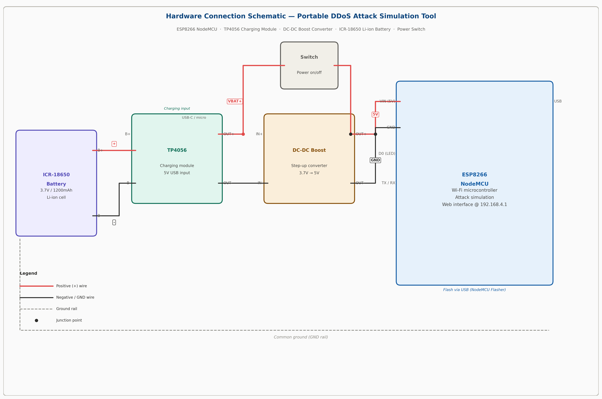
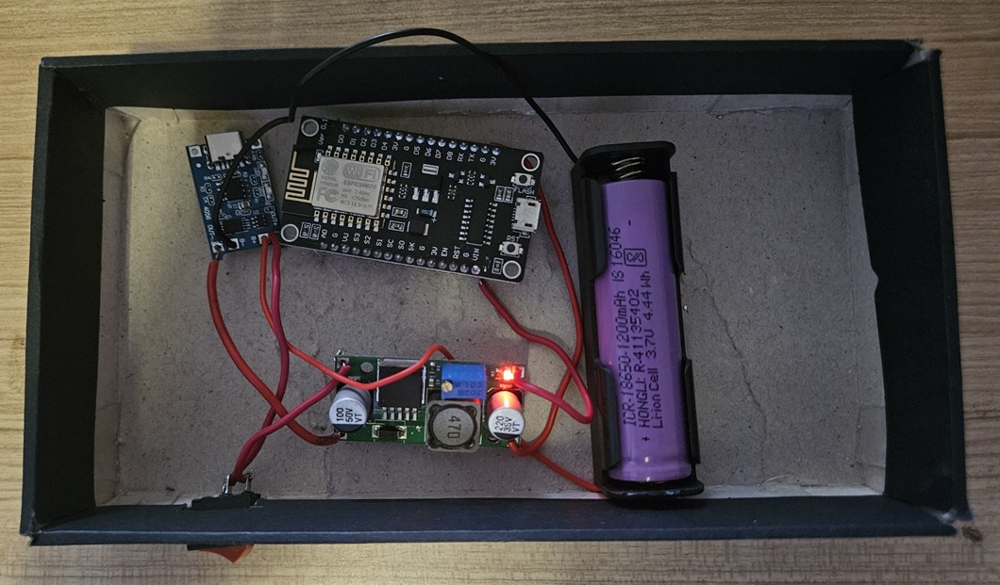

# 📡 Portable DDoS Attack Simulation Tool

> **⚠️ ETHICAL USE ONLY — Use exclusively on networks and devices you own or have explicit written authorization to test. Unauthorized use violates the CFAA, GDPR, and applicable local laws.**

---

## Overview

A compact, battery-powered Wi-Fi attack simulation tool built on the **ESP8266 NodeMCU** microcontroller, powered by the [SpacehuhnTech ESP8266 Deauther](https://github.com/SpacehuhnTech/esp8266_deauther) firmware. Designed for cybersecurity education, penetration testing training, and network vulnerability assessment in controlled environments.

The entire build costs approximately ₹850 (~$10) — 98% more affordable than PC-based alternatives like LOIC or Hping3.

**Research Paper:** *Portable DDoS Attack Stimulation* — R. Sreenidhi & Dr. Shweta Suryawanshi, Dr. D.Y. Patil Institute of Engineering, Management & Research, Pune, India. *(Publication pending)*

---

## Hardware

| Component | Specification |
|---|---|
| Microcontroller | ESP8266 NodeMCU |
| Battery | 3.7V Li-ion 18650 1200mAh (ICR-18650) |
| Charging Module | TP4056 |
| Boost Converter | DC-DC step-up module |
| Enclosure | Cardboard box (prototype) |
| Weight | < 200g |
| Range | Up to 100m (optimal) |

### Hardware Photos

#### Hardware Connection Schematic


#### Actual Build


*NodeMCU ESP8266 + TP4056 charging module + boost converter + 18650 Li-ion cell, housed in a portable cardboard enclosure.*

---

## Attack Modes

| Mode | Description | Measured Result |
|---|---|---|
| **Deauthentication** | Sends forged IEEE 802.11 deauth frames to disconnect devices from target AP | 92% disconnection rate within 10s |
| **Beacon Flooding** | Broadcasts 50+ fake SSIDs per cycle to clutter network scan results | 500+ fake SSIDs/min |
| **Probe Request** | Floods APs with probe requests for network reconnaissance | Ramps to 50 pkts/s within 5s |

---

## Firmware

This project uses the **SpacehuhnTech ESP8266 Deauther** firmware (1MB build).

- Firmware file: [`firmware/esp8266_deauther_1mb.bin`](firmware/esp8266_deauther_1mb.bin)
- Original source: [github.com/SpacehuhnTech/esp8266_deauther](https://github.com/SpacehuhnTech/esp8266_deauther)

---

## Flashing Instructions

### Tools Required
- NodeMCU Flasher (included in [`flasher/nodemcu-flasher.zip`](flasher/nodemcu-flasher.zip))
- Micro-USB cable

### Steps

**1. Extract the flasher**
```
Unzip flasher/nodemcu-flasher.zip
Run ESP8266Flasher.exe (Windows)
```

**2. Connect the NodeMCU**
- Plug in via Micro-USB
- Note the COM port (Device Manager → Ports)

**3. Configure the flasher**
- Select the correct COM port
- Under the **Config** tab, point to `firmware/esp8266_deauther_1mb.bin`
- Set flash address to `0x00000`

**4. Flash**
- Click **Flash** and wait (~1–2 minutes)
- LED blinks rapidly during flashing

**5. Connect and control**
- NodeMCU broadcasts AP: **`pwned`**
- Connect from phone/laptop → open `http://192.168.4.1`
- Use the web interface to scan, select target, and launch attacks

---

## Web Interface Usage

```
1. APs tab      → Scan → Select target network
2. Stations tab → Scan → Select target device (directed deauth)
3. Attacks tab  → Choose: Deauth / Beacon / Probe Request → START
```

---

## Project Flowchart


---

## Performance Benchmarks

| Metric | Value |
|---|---|
| Battery life (continuous) | ~2.5 hours |
| Attack success rate | 92% (deauth) |
| Beacon flood rate | 500+ fake SSIDs/min |
| Probe packet rate | 10 → 50 pkts/s |
| Cost vs LOIC/Hping3 | 98% more affordable |

### This Tool vs. LOIC / Hping3

| Feature | This Tool | LOIC / Hping3 |
|---|---|---|
| Portability | Battery-powered, pocket-sized | Requires PC + external power |
| Cost | ₹850 | ₹25,000–₹42,000+ |
| Setup | Flash once, no config needed | Complex configuration |
| Attack Types | Deauth, Beacon Flood, Probe | SYN/UDP/HTTP Flood |
| Beacon Flooding | ✅ 50+ fake SSIDs/min | ❌ Not supported |

---

## Future Scope

- [ ] SYN/UDP Flood attack modes
- [ ] DNS amplification simulation
- [ ] AI-driven traffic analysis & automated countermeasures
- [ ] Mesh networking for large-scale scenarios
- [ ] Attack logging and CSV export
- [ ] 3D-printed enclosure (replace cardboard prototype)

---

## Authors

| Name | Role | Contact |
|---|---|---|
| R. Sreenidhi | Student Researcher | sreenidhi.r.22@gmail.com |
| Dr. Shweta Suryawanshi | Faculty Advisor | suryawanshi.shweta02@gmail.com |

---

## Acknowledgements

Special thanks to [SpacehuhnTech](https://github.com/SpacehuhnTech/esp8266_deauther) for the ESP8266 Deauther firmware used in this project.

---

## License

This project is for **educational and research use only**. The authors are not responsible for any misuse. Always obtain explicit written authorization before testing on any network.

**USE IT ONLY ON YOUR OWN NETWORKS AND DEVICES.**
